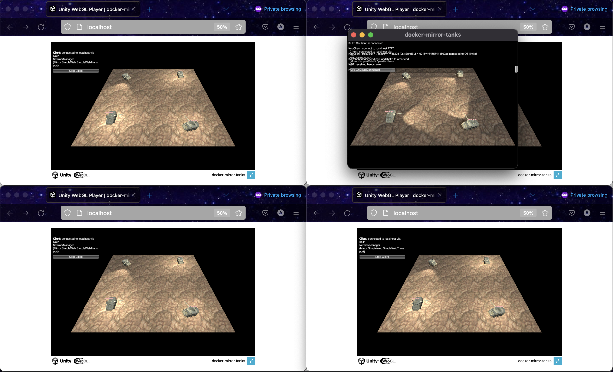
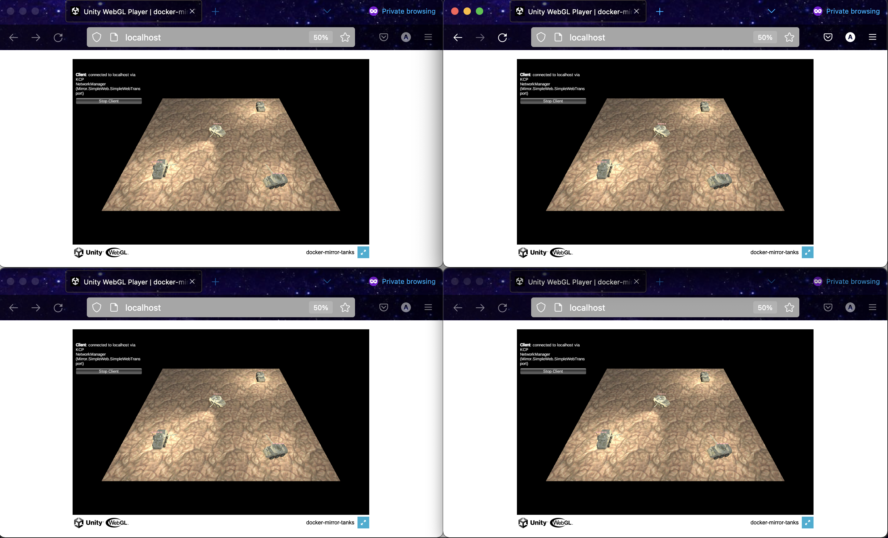

# Unity Mirror Networking in Docker and Docker Compose

__3 webGL web clients and 1 OSX app connect to the backend Mirror server.__

This sample project shows how to host a Unity Mirror Networking multiplayer game inside Docker and Docker Compose.

🎉 I'm happy this project has made the [Mirror Docker Community Guide](https://mirror-networking.gitbook.io/docs/community-guides/mirror-docker-guide)! I hope this project helps simplify concepts for others.

GitHub ⭐️s are always welcome =^_^=


## Requirements

- Docker
- Docker Compose
- Unity

## Usage

```bash
docker-compose up -d 

# Tail Mirror server logs
docker-compose exec tanks_backend_server bash -c "tail -f /root/server.log"

# Watch reverse proxy access, error logs
docker-compose logs -f tanks_reverse_proxy
# Watch static web client access, error logs
docker-compose logs -f tanks_web_client
```

## Build from Source
Open up the Unity project located at `./unity/docker-mirror-tanks` in the Unity Hub application.

Once the project is open in your Unity editor then build the required builds. Note you will need to be able to build WebGL, dedicated linux build, and optionally an app relevant to your operating system.

WebGL should be built to `./docker/tanks_web_client/webgl-build`.

The dedicated linux build should be built to `./docker/tanks_backend_server/build`.

### So what's in this project?
This project simulates a production environment using the techniques of docker and docker compose.

Web distribution is very dear to me. I wanted to see how to allow web clients to play a multiplayer experience with other application types.

I started by containerizing the Mirror Networking tanks demo. The default tanks scene uses the Kcp transport bound to UDP 7777. I create a docker-compose service that uses a dedicated linux server build of the Mirror Networking tanks scene. Once I connect from the editor I know I'm onto something. This is the first _Mirror server backend_ service.

I know nginx has an easy way of serving static web assets. Just stick your web files into `/usr/share/nginx/html` and run `nginx:alpine`. I test that I see a unity webGL player at localhost:8080. Easy, second _static web assets_ service is complete.

I know I will need to reverse proxy to avoid CORS. Another nginx container will serve. Configuring nginx is relatively straight forward and I'll sweep aside any trial and errors I endured to come up with final configuration 😅. This is the third and final service: the _reverse proxy_.

Thanks to @MrGadget who let me know about how to wire up a Multiplexer component to the Mirror Network Manager and enable both Kcp and Simple Web Transport (SWT) transports.


__4 webGL web clients connected to the backend Mirror server.__
